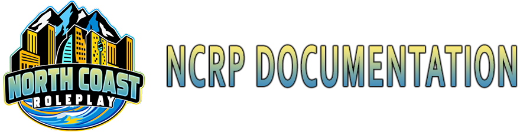

# Welcome to the NCRP documentation! 

## What is NCRP?

North Coast Roleplay is a Emergency Services roleplay community. We strive for the most realistic experience, starting the day you join the recruitment server. From arrest processes to laws, we have ensured that this will provide the closest thing to IRL as possible, yet still keeping it fun. 

NCRP is a fully whitelisted community, only allowing Members on patrol after being interviewed, screened and trained. NCRP features custom EUP, scripts and vehicles and is under constant development, and we use daily feedback to adjust the server to the needs of our Members.

## Brief history

Formally known as LSPS, one of the largest RP communities around. We re-branded to NCRP and developed, our Command Staff has taken all feedback and experience from prior iterations and is dedicated to bringing the best possible experience that we can. Leaning on over 30 years of combined experience in leadership roles within many communities, you can be assured that the Community is designed from the ground up to be the best possible for our Members.

## Why have a documention site?

This site will serve for any development of our servers. You will find keybindings, how to use our scripts, our changelog as well as a guide for using our CAD System.

## Our Development Trello
You may visit the following link to view our Trello board

[https://trello.com/b/M1sM87Gl/ncrp-development](https://trello.com/b/M1sM87Gl/ncrp-development)
