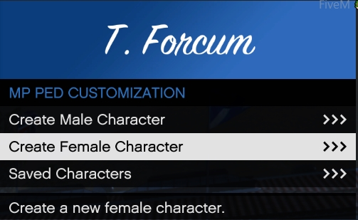

## Welcome to the start guide for NCRP
Below you will find the steps to start playing on our servers.

### How to use Vmenu.
We currently use Vmenu for creating players, spawning vehicles, and getting weapons in the server

To open Vmenu press F1 on your keyboard.

You will have the following options for normal users.

| Name | Description |
| ---- | ----------- |
| Online Players | Check to see who is online, TP to other players. |
| Player Related Options | Heal yourself, change your ped, create MP peds, add or remove weapons |
| Vehicle Related options | Spawn Vehicles, edit vehicles |
| Voice Chat Settings | Manage your voice settings |
| Recording Options | make clips while in game to edit later |
| Misc Settings | Vmenu Settings, wear you can save your settings, clear locals from a scene, etc. |

### How to create a player in Vmenu

In order to create a player in Vmenu, you will select mp ped customization in player related options.

Then you will click on either Create Male Character, or Create Female Character.

After selecting the gender of you ped you will then be given the options, to choose appearance, tattoos, clothes, and props.

After creating your character, make sure you save it, it will close after. Make sure you give it a name you will remember. 
!!! tip
    You can only have one character with the same name, if you have more then one of the same ped, with different clothes you will need to add to the name for it to save.

